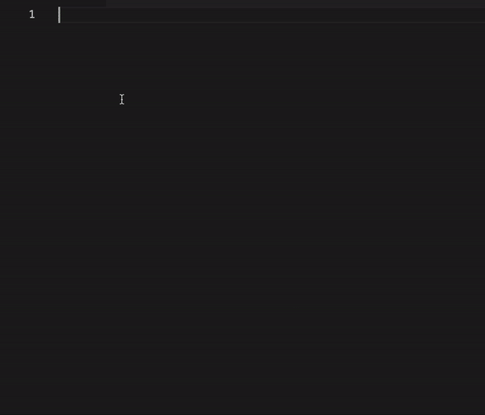
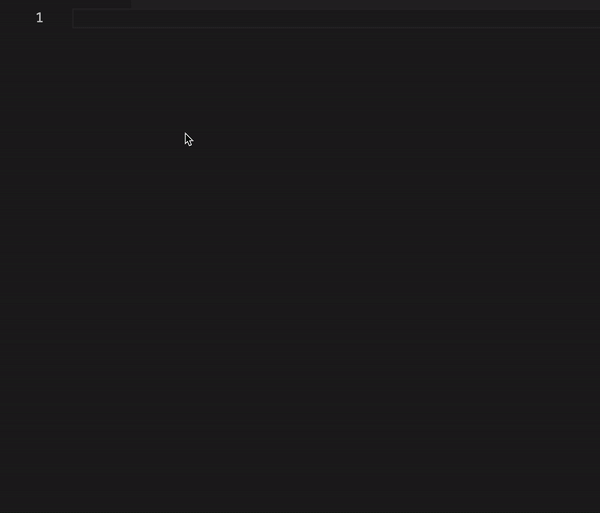

# express-jsdoc-swagger-snippets
VSCode snippets for express-jsdoc-swagger. You can add this extension to your VSCode so it is easier to generate the code for your endpoints.

## Features

**Endpoints**

You can use endpoint snippets after installing your extension just by writing any of these characters `endpoint` or `openapi:endpoint` to create and endpoint comment.

You can complete each field using `TAB` key while you are completing it like in this example:

**Components**

You can use components snippets after installing your extension just by writing any of these characters `component`, `openapi:component` or `typedef` to create and endpoint comment.

You can complete each field using `TAB` key while you are completing it like in this example:

## Release Notes

Users appreciate release notes as you update your extension.

### 1.0.0

Initial release of express-jsdoc-swagger-snippets.
- Endpoint snippet
- Component snippet

**Enjoy!**
